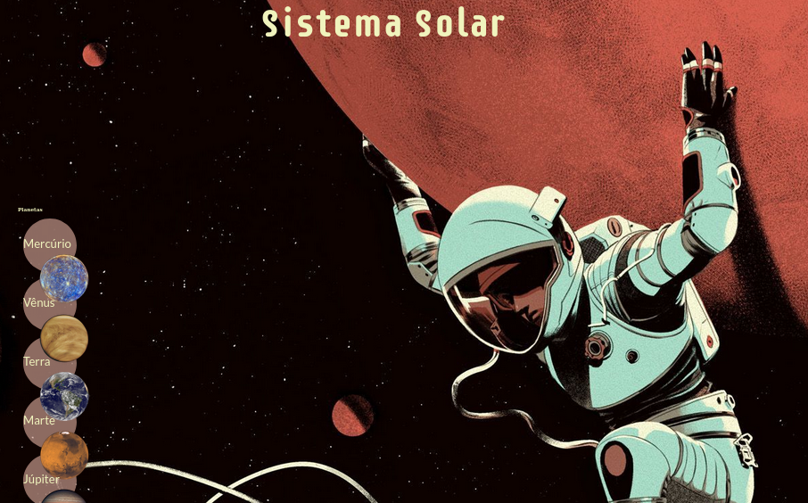
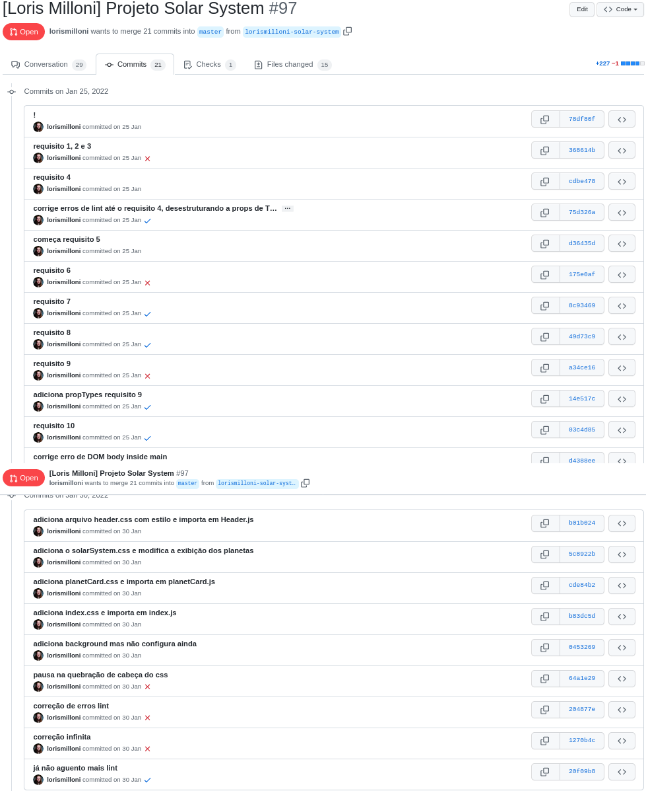
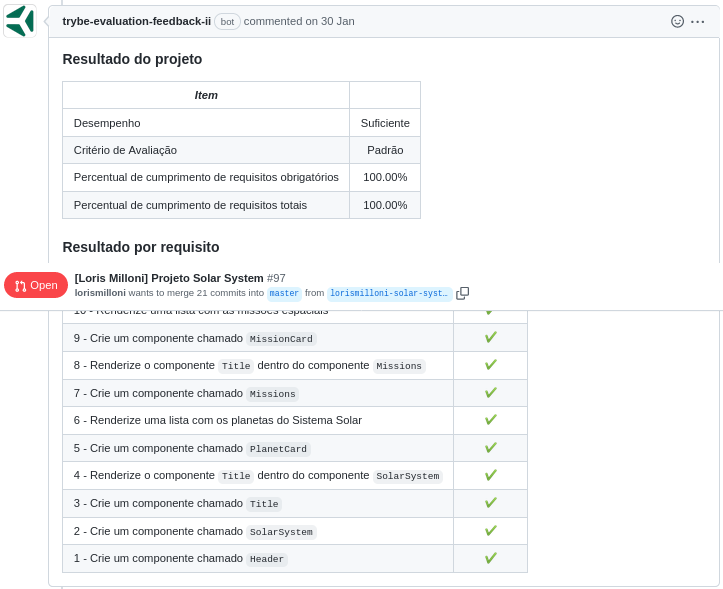

# studies-frontend-solar-system
Made in **25/01/2021**.

## This is my first website using React.
#### I was learning to use .jsx extension, understand the 'render()' to make components, 'import' to bring functionalities from different sources, class Components, props and validations with PropTypes. The goal was to show the solar system planets and cards with space missions.
   

#### At that time I wasn't very skilled with CSS, so checkout my new projects at [github.io](https://lorismilloni.github.io/).

#### Trybe has a private repository with files that can't be shared. So here is my commit history print:

#### Here is the Trybe Evaluator

